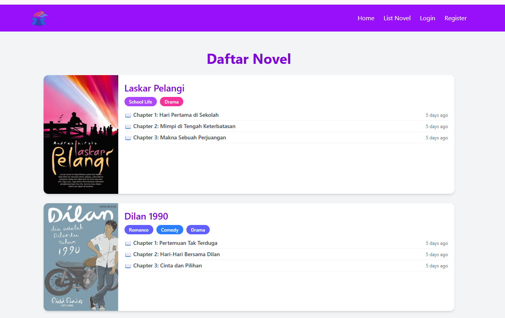
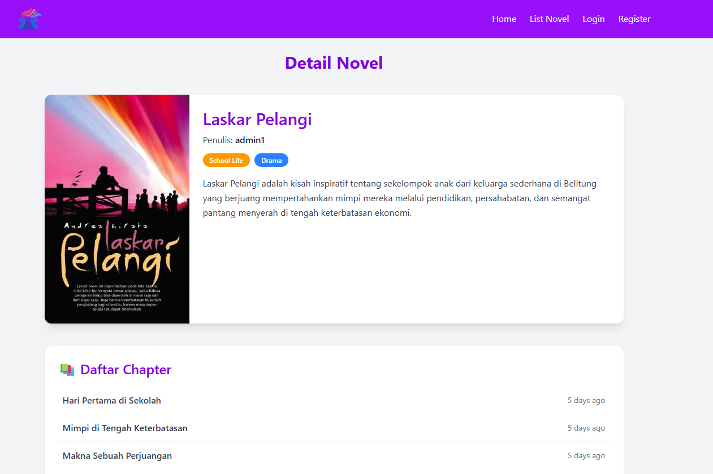

# 📚 NovelApp

NovelApp adalah aplikasi web untuk membaca novel secara online yang mendukung sistem multi-role. Aplikasi ini memungkinkan pengguna membaca novel, author mengelola karya, dan admin memantau seluruh data sistem.

---

## ✨ Fitur Utama

### 👤 Reader
- Membaca novel dan chapter
- Memberikan komentar pada chapter (setelah login)

### ✍️ Author
- Manajemen novel (tambah, edit, hapus)
- Manajemen chapter novel

### 🛠️ Admin
- Manajemen data user
- Manajemen data novel
- Manajemen genre
- Monitoring data sistem

---

## 🛠️ Teknologi yang Digunakan

### Backend
- **Node.js**
- **Express.js**
- **PostgreSQL**
- REST API
- JWTWebToken

### Frontend
- **Vue.js**
- **Tailwind CSS**
- Axios (API communication)
- Pinia (mengelola data global)

---

## ⚙️ Instalasi & Menjalankan Proyek

### Clone Repository
```bash
git clone https://github.com/username/novelapp.git
```
### setup backend
```bash
cd back-end
npm install
```

### Buat file .env
```bash
PORT=3000
DB_HOST=localhost
DB_USER=postgres
DB_PASSWORD=yourpassword
DB_NAME=novelapp
DB_PORT=5432
JWT_SECRET=your_secret_key
```

### Jalankan Backend
```bash
npm run dev
```

### setup front-end
```bash
cd front-end
npm install
```

### Buat file .env
```bash
VITE_API_URL=http://localhost:5000/api
```

## 📸 Dokumentasi Aplikasi

### Tampilan List Novel


### Tampilan Detail Novel

